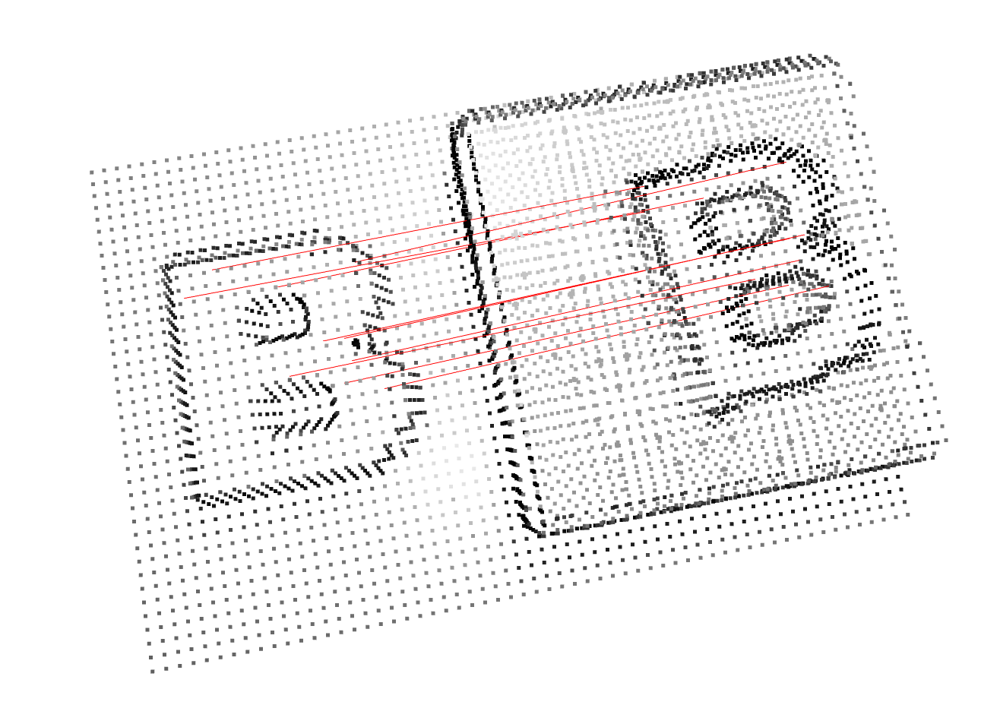

# 3DMatching via Dense Voxel-Wise Descriptor in Tensroflow
In this project, we learned dense voxel-space descriptor by porjecting single RGB-D image to TSDF(truncated signed distance function) volume. Ground truth label is acquired through blender where object pose, camera matrices are recorded.


## Prerequisites
* Blender == 2.8
* Python > 3.6.4
* Tensorflow == 2.0
* numpy == 1.17.2             
* opencv-contrib-python == 4.1.1.26 
* Open3d == 0.8.0.0
* scikit-learn == 0.21.3  
* tqdm == 4.36.1 

For blender download please visit blender [offical website].

## Usage
* Mesh files are in the env/mesh folder
* When processing mesh files you can follow the command blow. If you install blender in different path, then use your own blender path. 

```
/Applications/Blender.app/Contents/MacOS/Blender --background --python data_generation.py
```
* The script will give you object pose, camera pose, camera intrinsic matrix, and the RGB-D images of objects and its corresponding packages. Below is a example of objects and its corresponding package and visualiztion of the matching in on the image level.


* Run the following command to acquire TSDF volume and correspondence between object and packages. Configuration can be find in the config file.
```
python ./TSDF_Matching_Label/main.py
```
  * Below is the example of the reconstrucuted volume from TSDF and its corresponding matching in 3d space


  * All the points are sampled within the body mesh from dense point cloud grid. Below is the visualization of the point cloud grid. 

* To train the model run the following command.
```
python ./Model/train.py
```
* The validation file (On Going)

## Testing Results
on Going

## Feature Improvement
1.Regression on Coordinates difference(add another form of supervision)
2.Implement U net


## Reference
```
@inproceedings{zeng20163dmatch, 
    title={3DMatch: Learning Local Geometric Descriptors from RGB-D Reconstructions}, 
    author={Zeng, Andy and Song, Shuran and Nie{\ss}ner, Matthias and Fisher, Matthew and Xiao, Jianxiong and Funkhouser, Thomas}, 
    booktitle={CVPR}, 
    year={2017} 
}

