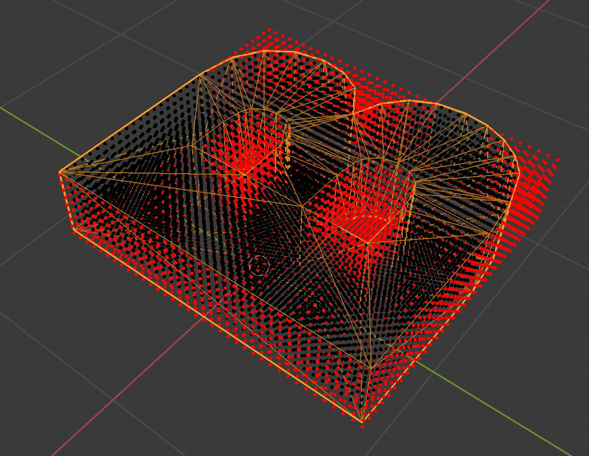
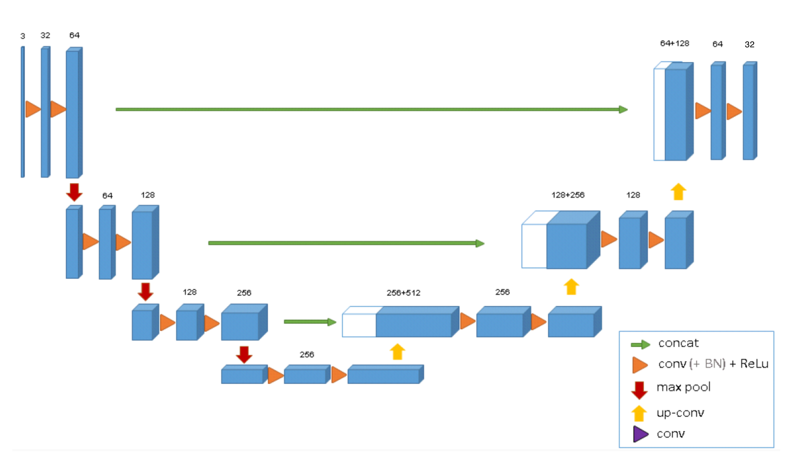
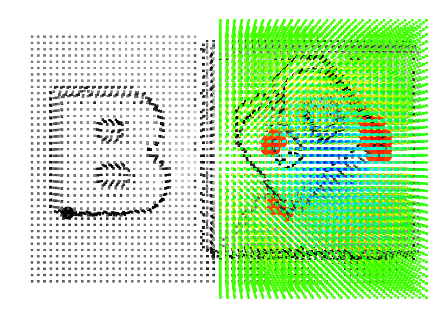
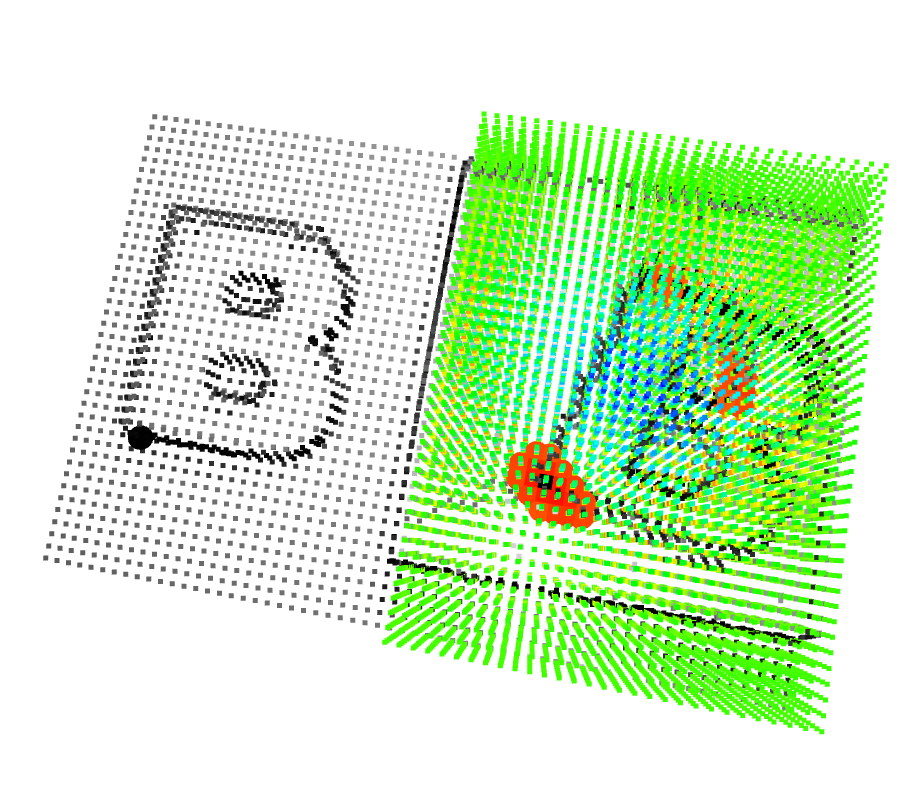
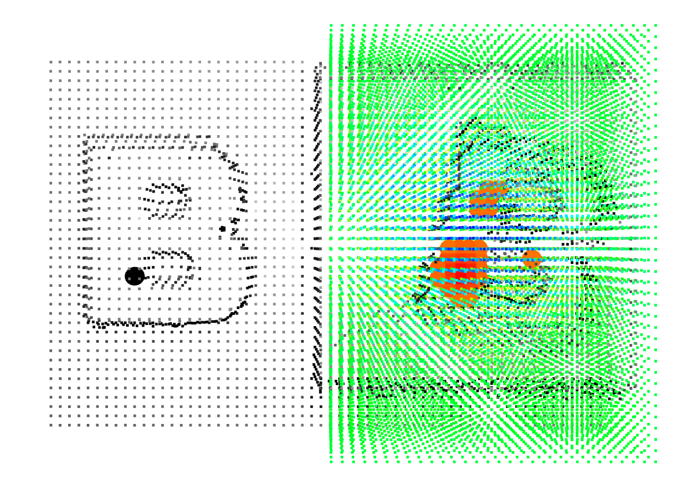

# 3DMatching via Dense Voxel-Wise Descriptor in Tensroflow
In this project, we learned dense voxel-space descriptor by porjecting single RGB-D image to TSDF(truncated signed distance function) volume. Ground truth label is acquired through blender where object pose, camera matrices are recorded.


## Prerequisites
* Blender == 2.8
* Python > 3.6.4
* Tensorflow == 2.0
* numpy == 1.17.2             
* opencv-contrib-python == 4.1.1.26 
* Open3d == 0.8.0.0
* scikit-learn == 0.21.3  
* tqdm == 4.36.1 

For blender download please visit blender [offical website].

## Usage
* Mesh files are in the env/mesh folder
* When processing mesh files you can follow the command blow. If you install blender in different path, then use your own blender path. 

```
/Applications/Blender.app/Contents/MacOS/Blender --background --python data_generation.py
```
* The script will give you object pose, camera pose, camera intrinsic matrix, and the RGB-D images of objects and its corresponding packages. Below is a example of objects and its corresponding package and visualiztion of the matching in on the image level.


* Run the following command to acquire TSDF volume and correspondence between object and packages. Configuration can be find in the config file.
```
python ./TSDF_Matching_Label/main.py
```
  * Below is the example of the reconstrucuted volume from TSDF and its corresponding matching in 3d space


  * All the points are sampled within the body mesh from dense point cloud grid. Below is the visualization of the point cloud grid. 

* To train the model run the following command.
```
python ./Model/train.py
```
* The validation file (On Going)

## Voxel Feature Learning Model Architecture
 
I used 3D U_Net to learn dense voxel-wise feature, and this feature will be used to estimate 12 DOF rigid body transformation . All the 3D convolution has kernel size 3 x 3 x 3. 

## qualitative assessment




Above graph are the 3D heatmap(point cloud) for the package. The heatmap is based on the l2 difference of learned feature between the ground truth in the object(left half of the pointcloud), a black point, and all the voxel space in the package. The red dots represents the top 30 corresponding voxels. As show in the figures above, the model is able to learn similar geometry,points have similar geometry tend to have smaller feature distance distance. The color itself is picked from hsv color palette where hue has value range from 0 degree to 240 degree. Red color indicates smaller l2 distance and blue color indicates large l2 distance.


## Reference
```
@inproceedings{zeng20163dmatch, 
    title={3DMatch: Learning Local Geometric Descriptors from RGB-D Reconstructions}, 
    author={Zeng, Andy and Song, Shuran and Nie{\ss}ner, Matthias and Fisher, Matthew and Xiao, Jianxiong and Funkhouser, Thomas}, 
    booktitle={CVPR}, 
    year={2017} 
}

